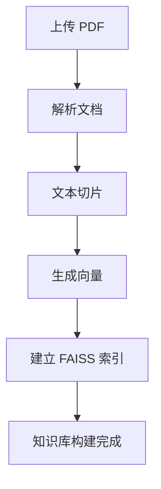
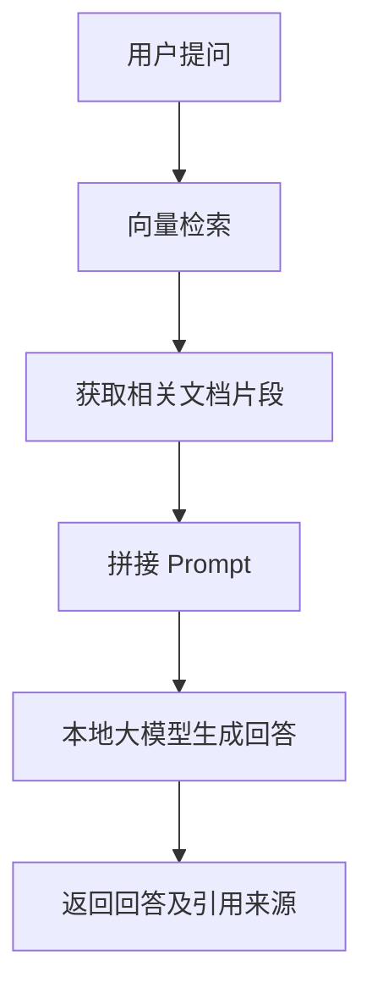
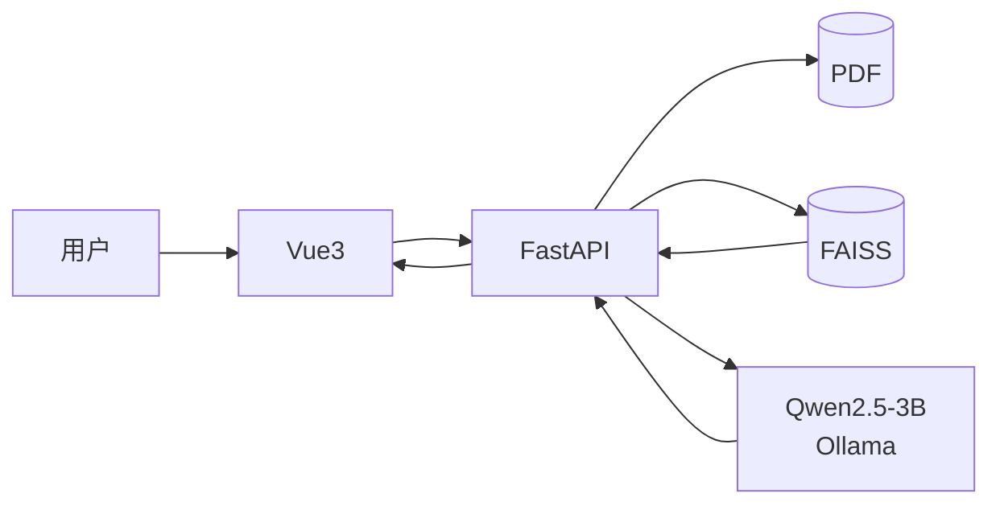

# DocAgent PRD

**Version:** v1.0
**Status:** Final
**Project:** DocAgent
**Document Type:** Product Requirements Document (PRD)

---

# 1. 项目概述（Project Overview）

| 项目         | 内容                             |
| ---------- | ------------------------------ |
| **项目名称**   | DocAgent                       |
| **项目类型**   | AI 文档助手（AI Document Assistant） |
| **开发模式**   | MVP（Minimum Viable Product）    |
| **目标用户**   | 学生（MVP）                        |
| **支持文档格式** | PDF                            |
| **部署方式**   | 本地部署                           |

**DocAgent 是一款面向 PDF 文档场景的 AI 文档助手。** 用户上传 PDF 文档后，系统自动完成文档解析、知识库构建，并基于 RAG（Retrieval-Augmented Generation，检索增强生成）技术回答用户提出的问题，同时提供回答来源，帮助用户通过自然语言快速获取文档中的信息，而无需反复翻阅原始文档。

第一版本聚焦学生学习场景，仅实现 PDF 上传、文档解析、知识库构建、智能问答和来源引用等核心功能，不包含用户登录、多知识库管理、OCR、聊天历史等非核心功能。

---

# 2. 产品介绍（Product Introduction）

## 2.1 产品背景（Background）

在学习过程中，需要频繁查阅课程资料的学生通常需要阅读大量教材、讲义和论文。随着文档数量和内容复杂度不断增加，传统的阅读方式难以快速定位所需知识，用户往往需要花费大量时间翻阅原始文档。

现有通用 AI 工具虽然能够回答问题，但通常需要用户重复上传文档，回答也缺乏与原文内容的关联和引用，不便于验证答案的准确性。因此，需要一种能够基于本地 PDF 文档构建知识库，并结合文档内容进行智能问答的工具。

---

## 2.2 产品定位（Positioning）

**DocAgent 是一款面向 PDF 文档场景的 AI 文档助手。**

系统支持用户上传一个或多个 PDF 文档，自动完成文档解析、知识库构建，并基于 RAG（Retrieval-Augmented Generation，检索增强生成）技术回答用户提出的问题，同时提供回答对应的文档引用来源，帮助用户快速获取文档中的信息。

第一版本聚焦学生学习场景，仅支持 PDF 文档，不支持 Word、OCR、多知识库管理等非核心功能。

---

## 2.3 产品目标与价值（Goals & Value）

DocAgent 的目标是实现一个轻量、易用的 AI 文档问答系统，完成 PDF 上传、知识库构建、智能问答和来源引用的完整流程，验证 RAG 在本地文档问答场景中的应用效果。

相比传统查阅文档的方式，用户无需反复翻阅原始 PDF，即可通过自然语言快速定位所需信息；相比通用 AI 工具，DocAgent 基于检索到的文档内容生成回答，并提供引用来源，提高回答的可信度和可验证性。同时，本地部署方案能够满足个人学习场景对文档隐私和低使用成本的需求。

---

# 3. 用户分析（User Analysis）

## 3.1 目标用户（Target Users）

第一版本面向需要频繁查阅 PDF 课程资料的学生用户。

典型使用场景包括：

* 查阅课程教材
* 阅读课程讲义
* 学习技术文档
* 阅读论文并快速定位相关内容

产品不限制 PDF 的具体内容，但第一版本以学生学习场景作为 MVP 验证对象。

---

## 3.2 用户痛点（Pain Points）

目标用户在查阅课程资料时主要存在以下问题：

1. PDF 文档内容较多，查找特定知识点需要频繁翻阅原文，检索效率较低。
2. 通用 AI 工具通常需要重复上传文档，难以长期维护个人文档知识库。
3. AI 回答缺乏原文引用，用户难以验证回答是否来源于文档内容。

---

## 3.3 当前解决方案（Current Solution）

| 当前方案      | 存在的问题                      |
| --------- | -------------------------- |
| PDF 阅读器搜索 | 只能进行关键词搜索，无法理解语义。          |
| 手动翻阅文档    | 查找效率低，耗时较长。                |
| 通用 AI 工具  | 需要重复上传文档，回答缺乏引用来源，难以验证准确性。 |

DocAgent 通过本地知识库和 RAG 技术，实现基于文档内容的智能问答，并提供回答引用来源，改善上述问题。

---

# 4. 功能列表（Feature List）

第一版本仅实现文档问答所需的核心功能。

| ID   | 功能     | 描述                   | MVP |
| ---- | ------ | -------------------- | :-: |
| F-01 | PDF 上传 | 支持上传一个或多个 PDF 文档。    |  ✅  |
| F-02 | 文档解析   | 自动解析 PDF 文本内容并完成预处理。 |  ✅  |
| F-03 | 知识库构建  | 文本切片、向量化并建立本地索引。     |  ✅  |
| F-04 | 智能问答   | 基于 RAG 检索文档并生成回答。    |  ✅  |
| F-05 | 来源引用   | 展示回答对应的文档引用来源。       |  ✅  |
| F-06 | 重新上传文档 | 删除当前知识库并重新建立索引。      |  ✅  |

---

# 5. 页面清单（Page List）

第一版本包含两个核心页面。

| 页面        | 功能                     |
| --------- | ---------------------- |
| 首页（Home）  | 上传 PDF、查看知识库状态、重新上传文档。 |
| 问答页（Chat） | 输入问题、查看 AI 回答及引用来源。    |

---

# 6. 核心业务流程（Business Flow）

## 6.1 文档处理流程

---

## 6.2 文档问答流程

系统包含两个核心流程：文档处理流程负责完成 PDF 解析、文本切片、向量化及知识库构建；文档问答流程负责根据用户问题检索相关文档片段，并结合本地大模型生成回答，同时返回引用来源，提高回答的可信度和可验证性。

---

# 7. 技术方案（Technical Solution）

系统采用前后端分离架构，基于本地 RAG 技术实现文档问答。

| 模块     | 技术选型               | 选择原因                |
| ------ | ------------------ | ------------------- |
| 前端     | Vue 3              | 开发效率高，生态成熟。         |
| 后端     | FastAPI            | 与 Python AI 生态集成方便。 |
| 大模型    | Qwen2.5-3B（Ollama） | 本地部署，资源占用低。         |
| RAG 框架 | LangChain          | 简化文档处理与检索流程。        |
| 向量模型   | BGE Small Zh v1.5  | 中文检索效果较好。           |
| 向量数据库  | FAISS              | 本地部署，无需额外服务。        |
| PDF 解析 | PyMuPDF            | 解析速度快，稳定性高。         |

---

# 8. 风险分析（Risk Analysis）

| 风险       | 影响       | 应对方案                |
| -------- | -------- | ------------------- |
| PDF 解析失败 | 无法建立知识库  | 第一版本仅支持文本型 PDF。     |
| 检索效果不佳   | 回答质量下降   | 调整文本切片策略及 Top-K 参数。 |
| 本地模型能力有限 | 回答不够完整   | 优化 Prompt 或升级模型。    |
| 大文档建库耗时  | 首次处理时间较长 | 建立索引仅执行一次，后续复用。     |

---

# 9. 验收标准（Acceptance Criteria）

满足以下条件即可认为 MVP 完成：

* 能上传一个或多个 PDF 文档。
* 能完成文档解析和知识库构建。
* 能基于文档内容回答用户问题。
* 回答能够展示引用来源。
* 支持删除知识库并重新上传 PDF。
* 系统能够在本地环境正常运行。
